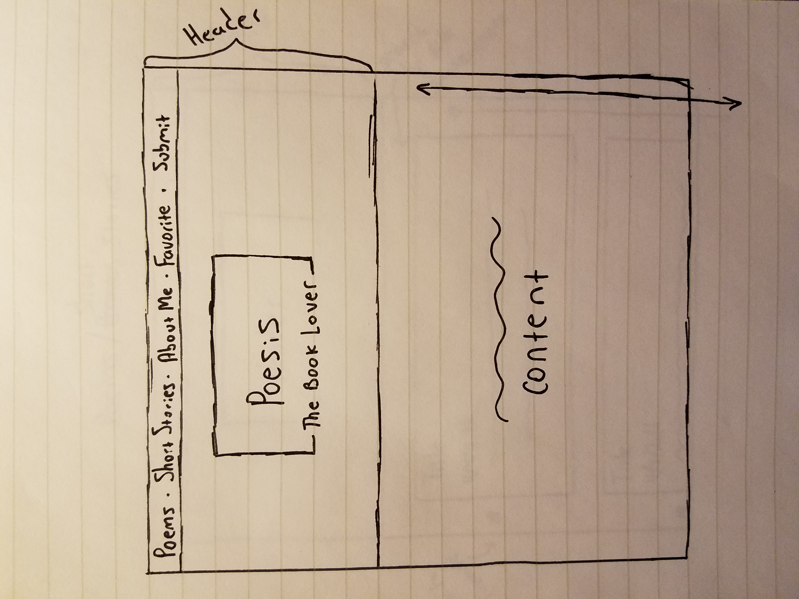
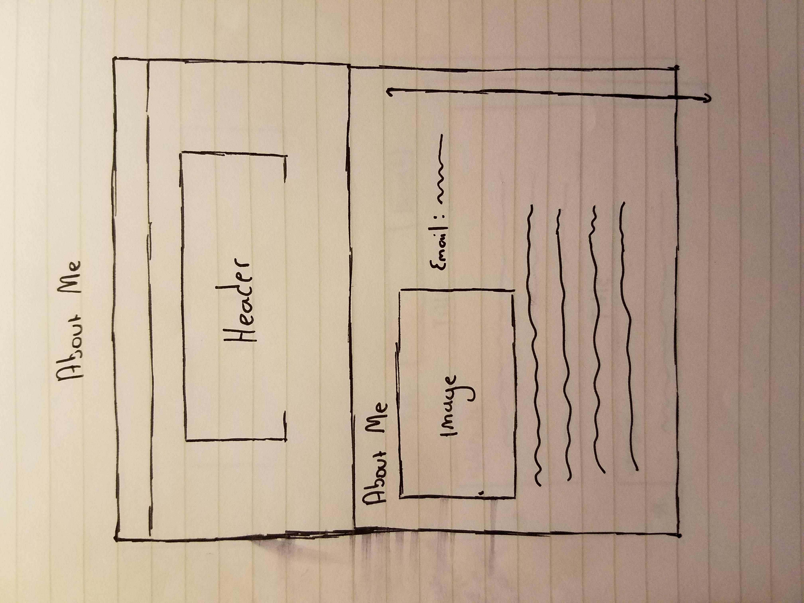
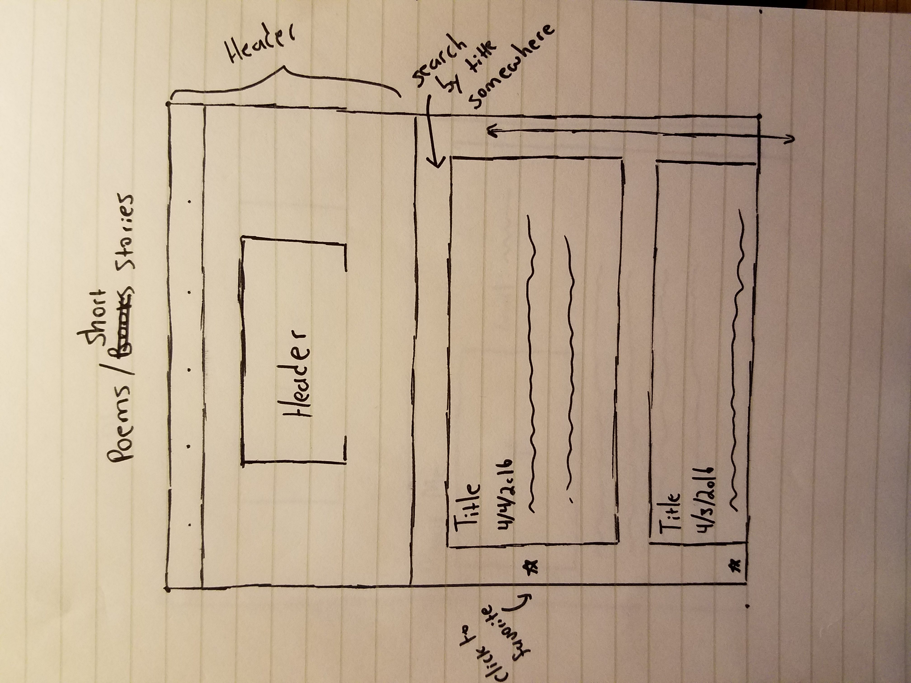
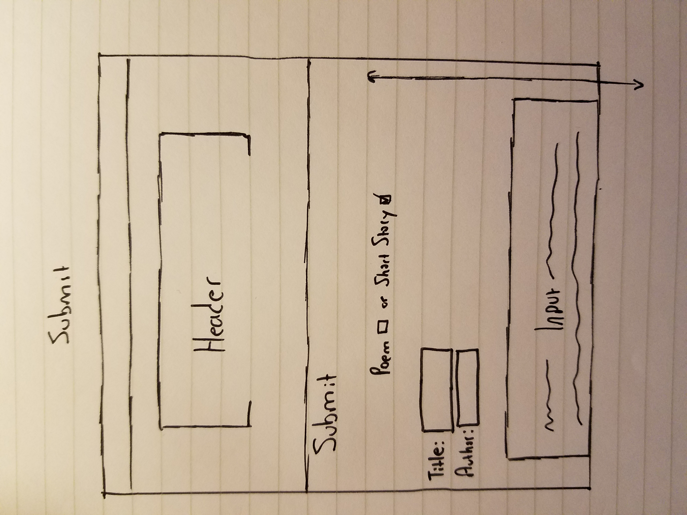

# Poesis

https://poesis.herokuapp.com/

## Overview

A literature blog that displays and organizes poems and short stories. Come witness works of literature from an NYU English Literature student. Browse a a large repository of famous poets such as William Shakespear or Edgar Allen Poe and their works.

Poesis is a website that allows users to get an inside view of an English Majors mind. Look into the workings of a developing young adult through her work. Ask her your questions and submit your own poetry in a private page. Enjoy a gallery of written art.


## Data Model

We'll  store the user, poems and short stories using MongoDB. Each user will initially be assigned a unique empty list that will contain the poetry they submit. Poems and short stories will be inserted by me or the admin and stored in collections.

First draft schema:

```javascript
// users
// * our site requires authentication...
// * so users have a username and password
// * they also can have 0 or more lists
var User = new mongoose.Schema({
  // username, password provided by plugin
  lists:  [{ type: mongoose.Schema.Types.ObjectId, ref: 'List' }]
});

//Poetry that will be displayed
var Poem = new mongoose.Schema({
	title: {type: String, required: true},
	author: {type: String, required: true},
	content: {type: String, required: true,
	date:{type: Date, required: false}
});

//Short stories that will be displayed
var shortStory = new mongoose.Schema({
	title: {type: String, required: true},
	author: {type: String, required: true},
	content: {type: String, required: true,
	date:{type: Date, required: false}
});
```

## Initial Wireframes






## Technologies

### User Authentication

User authentication allows for personalized accounts on web services. Each user has a username and password and their specific items on a particular web service (lists, favorites, etc) can then be tied to their account. Using this in this particular web application is crucial for saving lists that users have created to study from. These lists can be retrieved by the user by simply logging into their account and checking their lists. Will check out Passport.

### CSS Framework

CSS frameworks allow for easier web design that conforms better to current web design standards. It also provides the less graphically inclined with easy to customize templates for a variety of interface components. This would save a great amount of time in comparison to making these interface elements from scratch. 

### Bootstrap

Boostrap allows for simple integration of navbars, font styles and formats.

### Hosted

Hosted on Heroku with mLab, a cloud-based Mongo tool.

